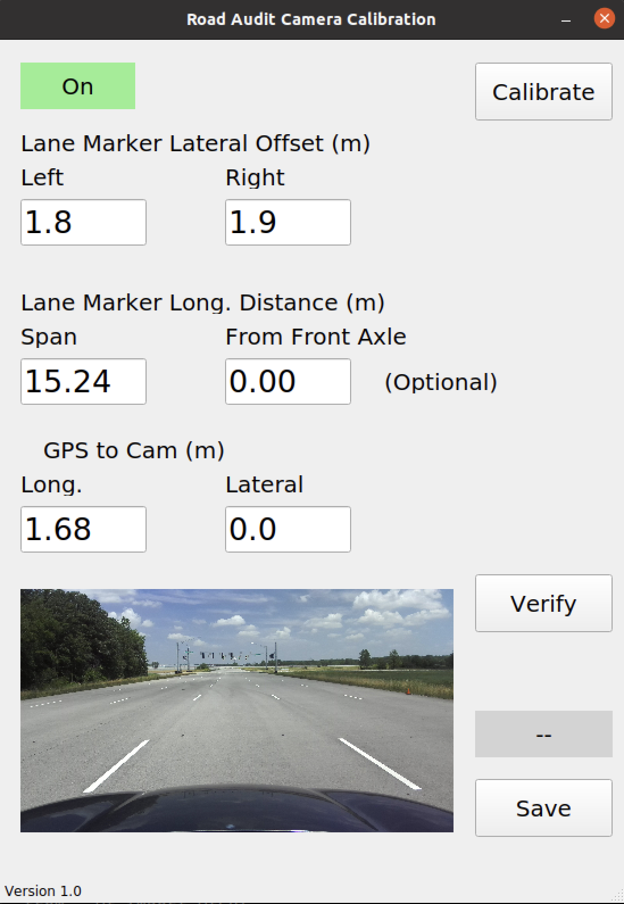

## Overview

* What is RA DAQ GUI software
* What is its purpose
* What are the components and their functions

RA-DAQ-GUI is a companion software to the ARRAT (road audit tool) designed to run in the vehicle compute platform that performs the data collection tasks for road audit. It is created as a ROS package and assumes the sensors required for road audit come with ROS packages as well. The two parts of the RA-DAQ-GUI software are:

* Calibration GUI
* Data Acquisition GUI

Below are the sections on calibrating the camera:

* Calibrate
* Verify
* Save


## ✅ Prerequisites

* Sensors are mounted
* Camera is powered and connected
* Markers on the ground that mimic lane markings
* Tape measure

<br>

## 🔧 Launch Calibration GUI

There are three methods to launch the software.

* Launch command ```roslaunch ra-daq-gui cal.launch```
* Use alias ```launch_racal```
* Use shortcut on Desktop

The GUI launches as shown in figure below.
The camera driver should automatically be launched and the status should be on (green) on top left corner.



## 🧬 Launch Calibrator

Click on **Calibrate** button. This opens the calibration image window as shown in figure below.


## Perform Calibration

Calibration procedure entails three steps.

* Picking specific image points
* Meausuring dimensions of specific points on the ground
* Verification and saving

### 🔄 Pick Points

There are four points on the ground, whose image coordinates and physical measurements are required for calibration. These points are shown in the image below.

1. Near marker left
2. Near marker right
3. Far marker left
4. Far marker right


Click on each of the points shown in the figure above and then press the equivalent key on keyboard.

* Click on point ```1``` and press key ```1``` on keyboard
* Repeat for all remaining points (```2```, ```3```, and ```4```)

### 🧬 Enter Measurements Information

There are 4 measurments to perform (one of which is optional).


1. Left lane line lateral offset in meters
2. Right lane line lateral offset in meters
3. Marker span - Longitdunal distance between marker points in meter (<em>Note: Use average of left and right span</em>)
4. Distance of near marker from front of the vehicle

Span (longitudinal distance) between near and far markers is recommended to be around 15 meters (50 feet).

Lateral positions of the markers are recommended to be standard lane width, 3.7 meters (12 feet).


### Verify and Save

Any change made to the calibration data will be reflected by **Modified** in red upon clicking **Verify** button as shown below.


After the points are picked and measurements are entered, click on ***Verify*** to see the ***Bird's eye view (BEV)*** of the calibrated image. It should appear like the image below. The left and right lane lines must appear vertical and the vertical axis will be limited to the marker span defined by the 4 points clicked. The lane defined by the picked points will occupy approximately middle third of the image.

Click on ***Verify*** to toggle back to the perspective view.

Click on **Save** when done.


### Calibration Data File

Calibration results are saved to the file ```/path/to/package/ra-daq-gui/config/inputs.json``` under tag ```cal_data```.


