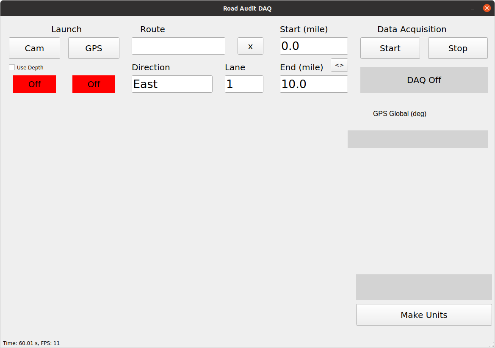
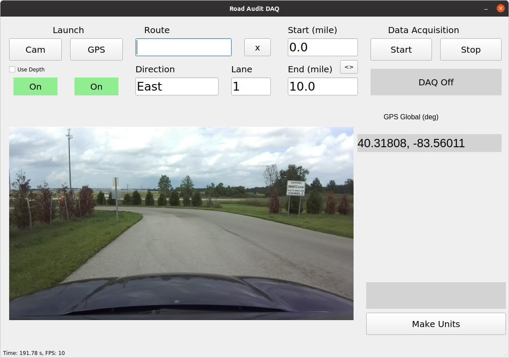
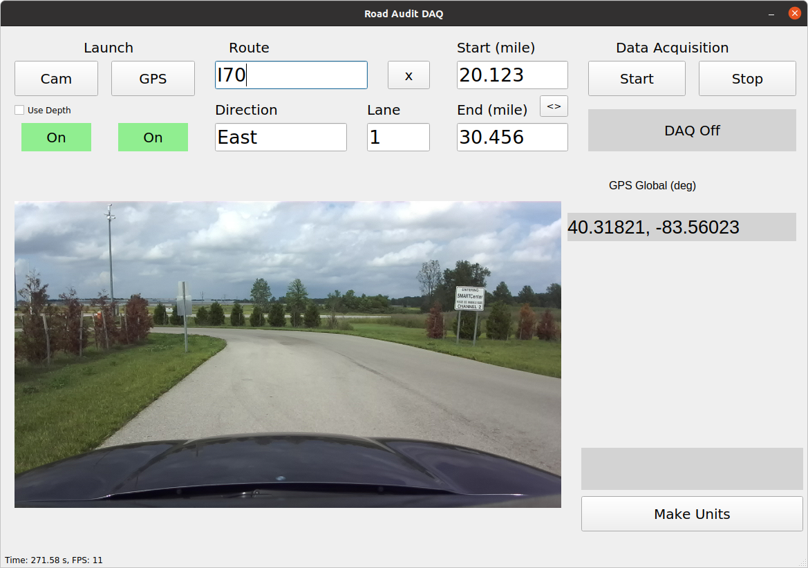
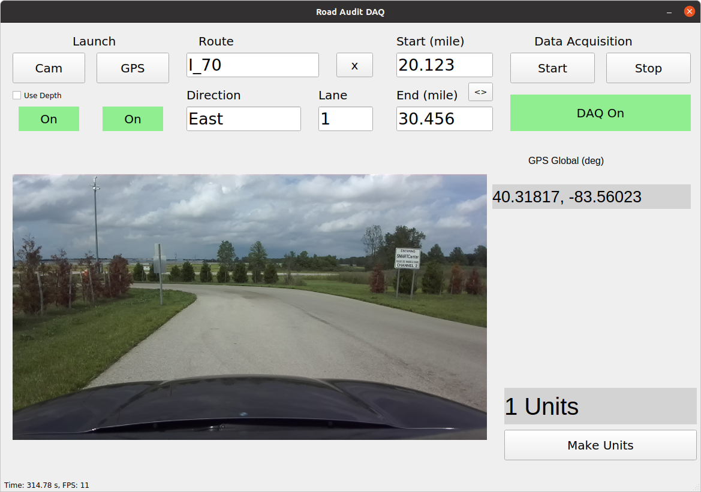

## Overview

* What is RA DAQ GUI software
* What is its purpose
* What are the components and their functions

RA-DAQ-GUI is a companion software to the ARRAT (road audit tool) designed to run in the vehicle compute platform that performs the data collection tasks for road audit. It is created as a ROS package and assumes the sensors required for road audit come with ROS packages as well. The two parts of the RA-DAQ-GUI software are:

* Calibration GUI
* Data Acquisition GUI

Below are the sections on the Data Acquisition GUI:

* Collect data
* Make units (ready to upload to ARRAT in the cloud)

## Data Collection

### ✅ Prerequisites

* Sensors are mounted
* Required calibration has been performed
* Sensors are powered
* Required GPS initialization procedures are performed (if applicatble)

<br>

### 🔧 Launch Main GUI

There are three methods to launch the software.

* Launch command ```roslaunch ra-daq-gui gui.launch```
* Use alias ```launch_ragui```
* Use shortcut on Desktop

The GUI launches as shown in figure below.



### 🧬 Launch Sensors

Use **Cam** and **GPS** buttons to toggle the camera and GPS sensor drivers on and off.

When the sensors are on and data is being received, the status will turn green. Additionally, the camera view will appear and GPS fix will be displayed as shown in figure below.



### 🧬 Enter Information

1. **Route** - the name of route being audited
    * Lower case letters are automatically capitalized
    * No special characters
    * Hyphens (-) are converted to underscores (_)
2. **Start (mile)** - intended start point mile marker
3. **End (mile)** - intended end point mile marker
4. **Direction** - intended direction
    * East/West
    * North/South
5. **Lane** - intended lane number




### 🔄 Collect Data

Use **Start** and **Stop** buttons to toggle the data acquisition on and off.

* Drive to the desired start mile marker
* Click **Start** - DAQ status changes to DAQ ON in green
* Continue collecting data until the end mile marker
* Click **Stop** to stop collecting data - DAQ status changes to DAQ Off in gray
* Current total **number of units** collected in teh route is shown on bottom right



Once the data collection is complete, the data must be converted from raw to standard format compatible with ARRAT.

## Unit Maker

Click on **Make Units** to convert raw data to standard units, which are ready to upload to the cloud.

Unit data is created in the sync directory defined as `sync_dir` in the configuration file `<ros_workspace>/src/ra-daq-gui/config/gui.yaml` (see deployment guide for details on the ROS workspace and package folder structure).

## Sync

1. Change directory to the sync script location (default is `<ros_workspace>/src/ra-daq-gui/scripts/data_sync.sh`)
    ```bash
    cd <ros_workspace>/src/ra-daq-gui/scripts
    ```
2. Execute the sync script
    ```bash
    AWS_ACCESS_KEY_ID="<your access key id>" AWS_SECRET_ACCESS_KEY="<your secret access key>" bash ./data-sync.sh "s3://tac-image-staging/"
    ```

_You may need to update `s3://tac-image-staging/` to the `SessionInputBucketName` generated while deploying the Pipeline and Step Functions during the [infrastructure deployment][infrastructure-deployment-link]. Remember to put `s3://` before and `/` after the SessionInputBucketName_

> \[!NOTE]
>
> You can grab `your access key id` and `secret access key` from the `/arratoperator/credentials/ArratOperator` secret. `your access key id = ACCESS_KEY` and `your secret access key = SECRET_KEY` from the stored secrets's SecretString. These values were generated while deploying the Pipeline and Step Functions during the [infrastructure deployment][infrastructure-deployment-link].
> 
> Navigate to the AWS Secrets Manager through the web portal or run `aws secretsmanager get-secret-value --secret-id /arratoperator/credentials/ArratOperator --profile arrat-cli` to get the values.
>
> _If needed, update arrat-cli to the profile configured during the prerequisites step_

## References

* Installation guide
* Calibration guide
* Sync Data to Cloud

<!-- Link Groups -->

[infrastructure-deployment-link]: https://github.com/arrat-tools/deploy/blob/main/guide/01-deploy-the-infrastructure.md
